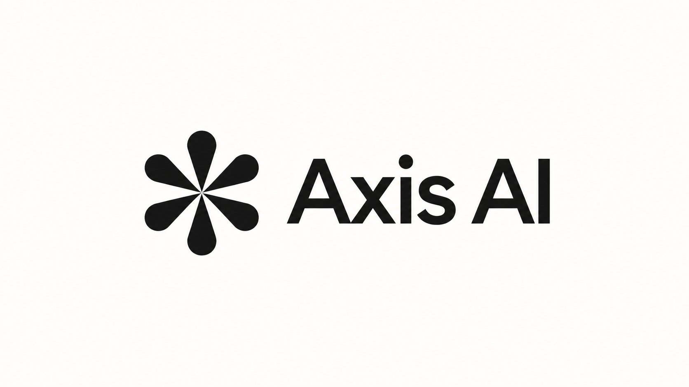
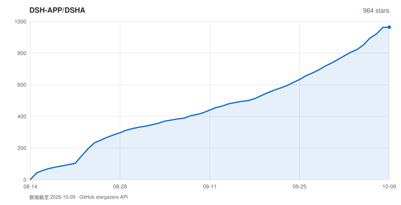

# DSHA

<p align="center">
  <b>DeepSeek Harness launcher for Android</b><br>
  Run the full <a href="https://github.com/deepseek-ai/deepseek-harness">deepseek-harness</a> on your phone — no root, no Termux, nothing to type
</p>

<p align="center">
  <a href="LICENSE"></a>
  <a href="https://github.com/DSH-APP/DSHA/releases/latest"></a>
  <a href="https://github.com/DSH-APP/DSHA/stargazers"></a>
  
  
  <a href="https://afdian.com/a/dsha_apk"></a>
  <a href="https://qm.qq.com/q/N5aZSlnmgM"></a>
</p>

<p align="center">
  <b>English</b> · <a href="README.md">简体中文</a> · <a href="https://dsha.cc">dsha.cc</a> · <a href="CHANGELOG.md">Changelog</a> · <a href="docs/security-model.en.md">Security model</a> · <a href="AGENTS.md">AGENTS.md (for AI / contributors)</a>
</p>

> 🤖 If you are an AI agent or a new contributor, read **[AGENTS.md](AGENTS.md)** first
> (structure, startup contracts, traps we already fell into). Don't scan the whole repo.

## ❤️ Sponsor

<table>
<tr>
<td width="180"><a href="https://zdxjl.com/register?aff=WDYTNDJ5LT4X"></a></td>
<td>Thanks to <a href="https://zdxjl.com/register?aff=WDYTNDJ5LT4X">绿萝中转站 (Lvluo Relay)</a> for sponsoring this project! Lvluo Relay is an AI platform covering models from many vendors: mainstream large models are ready to use on demand, and coding, image generation and more can all be called from one platform. Models from China and abroad are available, new releases land promptly, the service is attentive and the pricing is attractive. Registering through this link gives a 105% top-up bonus.</td>
</tr>
</table>

<table>
<tr>
<td width="180"><a href="https://ai.onyxaxis.org/"></a></td>
<td>Thanks to <a href="https://ai.onyxaxis.org/">Axis AI</a> for sponsoring this project! Axis AI is a free public-interest AI platform where multiple mainstream models are ready to use. Chat, write code, and generate images from one unified platform.</td>
</tr>
</table>

---

## What this is

DeepSeek Harness (`@deepseek-ai/dsh`) is DeepSeek's official agent harness — think Claude Code.
It is written for glibc Linux, and running it on Android directly hits a wall of problems:
native modules that won't compile, `link(2)` blocked by SELinux, sandboxes that won't start,
and a front end laid out for desktop screens.

**DSHA wraps all of that into a single APK.** Install, enter an API key (or skip), tap Start —
no Termux, no root, not a single command. Inside is a complete Ubuntu environment: `apt` works,
interactive PTYs work, native modules that need compiling install fine — the same stack you'd
use on a server.

Maintained and released by contributor [@ym2025szz](https://github.com/ym2025szz), with thanks to
original author [@qiannianhuanxiang](https://github.com/qiannianhuanxiang) and all other contributors.

---

## Download

Current release: **v0.2.0-rc2 · build170** ([release notes](https://github.com/DSH-APP/DSHA/releases/tag/v0.2.0-rc2) ·
[full changelog](CHANGELOG.md)). Both builds share the `com.dsh.client` package and app data —
**they cannot be installed side by side**:

| Build | Devices | Web engine | Download | Size |
|---|---|---|---|---:|
| **Standard** | Android 11+ / arm64 | System WebView; experimental virtual display | [APK](https://github.com/DSH-APP/DSHA/releases/download/v0.2.0-rc2/dsha-0.2.0-rc2.apk) · [SHA-256](https://github.com/DSH-APP/DSHA/releases/download/v0.2.0-rc2/dsha-0.2.0-rc2.apk.sha256) | 273.10 MiB |
| **Low** | Android 6+ / arm64 | Bundled GeckoView 143; no virtual display yet | [APK](https://github.com/DSH-APP/DSHA/releases/download/v0.2.0-rc2/dsha-0.2.0-rc2low.apk) · [SHA-256](https://github.com/DSH-APP/DSHA/releases/download/v0.2.0-rc2/dsha-0.2.0-rc2low.apk.sha256) | 345.27 MiB |

- **Upgrading**: overwrite-install with a same-signature APK (certificate fingerprint `e7e3a3…a53f5`; verification steps in the [security model](docs/security-model.en.md)). Same Ubuntu base version only updates managed components, without rebuilding the environment.
- **This download**: use the APK and matching SHA-256 links above; see [verification](docs/download-verification.en.md). In-app updates separately read the release manifest from [dsha.cc](https://dsha.cc).
- **Older versions**: [Releases](https://github.com/DSH-APP/DSHA/releases).

This is a **regular GitHub release / Latest**, not a prerelease. Version code **170**; the Ubuntu base remains **10**. [Matching source](https://github.com/DSH-APP/DSHA/tree/v0.2.0-rc2).

### Changes and previous releases

- Bundled DSH is now **0.2.0-rc.2**, with mobile UI **3.0.5** and fixes for phone focus, dialogs and plugin cards.
- Files open the system document picker directly, with multiple selection. Image draft saving/restoration, first-time offline ADB preparation and chat shell `/tmp` failures are fixed.
- Web files can use native sharing and saving. Virtual-display setup and LAN failure messages are clearer; exports, storage guidance and skills are grouped under Data & backups.
- Plugins enable after package checks and support dependency install scripts. New exports are password-free `.tar.gz` files; older encrypted backups remain readable.

| Earlier release | Main additions in this release |
|---|---|
| [v0.1.7-rc2 / 147, previous official release](https://github.com/DSH-APP/DSHA/releases/tag/v0.1.7-rc2) | DSH 0.1.7 → 0.2.0 rc2, mobile UI 3.0.3 → 3.0.5, plus the file, draft, ADB, shell, plugin and backup changes above. |
| [v0.1.5-rc2 / 129](https://github.com/DSH-APP/DSHA/releases/tag/v0.1.5-rc2) | Also includes automatic backups, independent recovery, requested microphone access, PiP, the experimental Standard virtual display and managed-update improvements. |
| [v1.1.10 and earlier](https://github.com/DSH-APP/DSHA/releases/tag/v1.1.10) | Two APK editions, managed Ubuntu/DSH updates and host-side backup/restore replace the old architecture. The complete direct-upgrade matrix has not been revalidated; original documentation remains in historical tags. |

Both editions passed **45 targeted unit checks and Release Lint**. Android 13 checks cover signed overlay installs, attachment/image-draft behavior in both web engines, 15 offline ADB dependencies and final startup. Full wireless pairing, the reported vivo Android 16 device, Android 6/7, 16 KiB devices and final native SAF saving were not checked in this round. [Release notes](docs/releases/v0.2.0-rc2-notes.md) · [build170 acceptance](docs/releases/v0.2.21-build170-20261009.md).

### Getting started

1. Install the APK (arm64 only; Android 11+ pick Standard, older systems pick Low)
2. First launch extracts and prepares the offline environment; time varies by device. The historical complete cold install took 42.412 seconds, above the 30-second target
3. "Configure" → enter your DeepSeek API key → "Start" → the Web UI opens automatically

That's it. For finer control, use the step-by-step install — each step can be reinstalled and updated independently.

---

## Why DSHA

|  | What you get |
|---|---|
| 🚫 **Zero command-line barrier** | Offline Ubuntu rootfs bundled in the APK. No Termux, no pkg, nothing to type |
| 🐧 **Full glibc environment** | Not a trimmed distro: `apt` / PTY / native modules / Python / git all included. Upstream plugins run unmodified |
| ⚡ **proroot, zero ptrace overhead** | Classic proot pays two context switches per syscall; proroot does in-process path translation via LD_PRELOAD + binary patching. Measured **+58%** on key benchmarks on a real device |
| 🔌 **The phone is the agent's hands** | Accessibility + ADB without Shizuku + an independent virtual display: read screens, tap, install apps, run automations — all built in |
| 💾 **Export for migration** | Data & backups exports password-free `.tar.gz` archives. Storage guidance shows the actual location; local copies are not guaranteed to survive uninstall |
| 🩺 **Failures that explain themselves** | Component-level checks + on-demand repair + startup diagnostics + an independent recovery DSH; when the web UI won't start, it names the plugin at fault |

---

## Core modules

### ① Setup & environment

| Capability | Details |
|---|---|
| Bundled offline rootfs | Ubuntu 24.04 (noble) arm64 inside the APK — deployment works with no network |
| Six-step install pipeline | Extract → base tools → Node.js → pnpm → dsh → patches; each step is probed before it runs and verified after; only failed items get repaired, never start from scratch |
| Per-step reinstall / update | rootfs, tools, Node and the harness are independent — reinstall any of them without re-downloading the rest |
| Two install paths | Prebuilt bundle or source build; the source path handles node-pty and other native module compilation automatically |
| Offline toolchain | curl / git / Python / CA certificates pinned via `packages.lock.json` — no dependency on the user running `apt` first |
| Mirrors & networking | apt falls back between official and USTC mirrors automatically; three DNS modes (auto / force IPv4 / system native), and a failed AAAA lookup retries resolution only — never replays the HTTP request |
| Versioned base environment | The Ubuntu base carries its own version number; app updates never rebuild the environment, and ordinary dsh updates never bump the base version |

### ② Runtime

| Capability | Details |
|---|---|
| proroot / proot dual runtime | Stable proot is the default; proroot can be selected in Configure, subject to device compatibility |
| Measured speedups | vivo V2352A / Android 14: +58% across key benchmarks, +94% tar packaging (backups use this path), +82% stat-heavy workloads (node module resolution) |
| Bounded compatibility fallback | Retry proot once only after proroot exits before authentication without a plugin failure and guest exit is confirmed; slow startup never triggers fallback |
| Node.js 24 + pnpm 10 | Same runtime as upstream, versions pinned with the APK |
| Split-package updates | Ubuntu and the dsh runtime ship as separate packages inside the APK; cold installs extract both, partial updates read only the dsh package |
| Managed update trials | A new environment boots for real in an isolated area first — ports, auth, session read/write and plugin loading are verified before it is committed; failures roll back automatically |
| Foreground service + watchdog | Running state visible in the notification shade; the Web UI is pulled back up automatically if it dies |
| Slow-start protection | Waiting for auth has no kill timeout (a hint appears at 60 s); the watchdog never mistakes a slow start for a fault |

### ③ Data & backups

| Capability | Details |
|---|---|
| Storage and migration | Data & backups → Storage guidance shows the actual location. Updates preserve current data; export needed content before uninstalling |
| v5 backups and exports | New exports are password-free `.tar.gz` integrity archives. Internal automatic copies remain encrypted; older encrypted originals still require their original password |
| Automatic backup schedules | On by default: daily at a chosen time, every 1–168 hours, or after stopping DSH; running backups wait instead of interrupting your work; keeps the latest 3 verified copies |
| Scoped backups | Full / conversations only / plugins only / settings only; restoring a partial backup touches only its own scope |
| Restore on another device | Export actual conversations, attachments, settings and user plugins; check digests and scope before restore preview, retaining current content and conflicting originals |
| Credentials never enter backups | The bridge token is excluded whole; `.credentials.yaml` is stripped field-by-field — machine keys removed, user API keys kept |
| Older backup compatibility | Full authentication/digest verification precedes restore preview; unknown or incomplete dependencies are reported. The current APK rebuilds system plugins, retaining user originals |
| Corrupt session quarantine | Broken session files move to `corrupt-backup` where you can retrieve them — one bad file can't take down the whole web UI |
| Post-upgrade cleanup | Regenerable caches and surplus old copies are cleaned in idle time after upgrades; at least two healthy predecessors are kept, and modified originals are never touched |
| Full factory reset | Core data roots are deleted strictly and re-verified; only WebView caches and similar recreatable directories may downgrade persistent errors to warnings |

### ④ Device capabilities (the agent's hands on this phone)

The agent calls these through the local `127.0.0.1:3090` bridge (token-gated; `/app/help` lists every endpoint):

| Capability | Details |
|---|---|
| Screen control | **Via the accessibility service — no ADB needed**: structured screen dumps with tappable regions, tap by text or coordinates, text input, key events, swipes, PNG screenshots |
| Virtual display (experimental) | Standard / Android 11+: authorize ADB, Shizuku or Root, then create a display on its page. Accessibility alone does not create one; see the [setup guide](docs/virtual-screen-guide.md) |
| Wireless ADB | Built-in pairing (TLS 1.3-PSK + SPAKE2) and keep-alive — **no Shizuku required**; survives reboots |
| Shizuku / Root channels | Backup device-command channels, bound by the same command allowlist |
| Talking to the user | System notifications, in-app toasts, vibration (wake the user after long jobs), a three-option blocking prompt, share / open URLs |
| File exchange | Read directories and text files, export artifacts to `Download/DSHA`; credential areas (`.dsh` / `.ssh` / `.android`) are blocked from both reads and writes |
| Sensors & location | Light / accelerometer / gyroscope / magnetometer / barometer / step counter / location / flashlight — all off by default, granted per capability |
| Clipboard | Read and write (subject to Android foreground restrictions) |
| Dangerous-command gatekeeper | Device commands always pass through an allowlist parser: partitioning / formatting / SELinux / system property writes are rejected outright, unknown commands never pass; blocks return `[POLICY_BLOCKED]` instead of a "allow anyway" dialog |
| SMS reading | A separate sensitive capability: strictly read-only queries, confirmed per query by default, revocable, never restored from backups |

### ⑤ Terminal

| Capability | Details |
|---|---|
| Real PTY terminal | Termux terminal-emulator JNI: vim / htop / tmux and other full-screen TUIs just work |
| Phone keyboard compensation | Extra key row (Ctrl / Alt / Esc / arrows / Tab); pinch to change font size |
| Multiple tabs | Sessions persist across tab switches, rotation and language changes |
| Simple-terminal fallback | If PTY misbehaves on some device, switch to the simple terminal with the session kept alive in the background |

### ⑥ Web UI & access

| Capability | Details |
|---|---|
| Dual engines | Standard uses the system WebView; Low bundles GeckoView 143, immune to whatever WebView the system ships |
| Mobile adaptation | Bundles [dsh-web-mobile](https://github.com/mexiaosqwq/dsh-web-mobile) **3.0.5** (MIT), retaining phone shortcuts and narrow-screen layout while fixing focus, dialogs and plugin cards |
| Picture-in-Picture | The conversation window supports a PiP mini window |
| High refresh & power | Requests the display's peak refresh rate (120 Hz with zero dropped frames measured); hands control back to the system when idle |
| Themes & languages | Dark / light / follow system; Simplified Chinese / English, following the system language by default |
| LAN access | Use dsh from a laptop or tablet browser over Wi-Fi. Token auth is fail-closed; on first hit it sets a `SameSite=Strict` cookie so the token never leaks through outbound links |
| Legacy browser compat | Injects `AbortSignal.any/timeout` and `crypto.randomUUID` polyfills (the latter is required over plain-HTTP LAN) |
| Streaming overlay | Agent output sticks to the top of the screen like lyrics; tool calls are translated into plain language; colors / opacity / line count adjustable; dangerous commands can be approved right on the overlay |
| Configurable port | Pick a custom Web port; conflicts fall back automatically with a clear explanation |

### ⑦ Plugin ecosystem

| Capability | Details |
|---|---|
| Plugin market | Install / update / enable / disable / delete / search / sort, entirely in-app; works with the [dsha.cc](https://dsha.cc) catalog and community plugins |
| Many install paths | GitHub shorthand / tree / blob / archive / Release links, direct HTTPS archive URLs, local import (format detected by content, not extension), or `dsha-plugin install` in the terminal |
| Multiple download sources | Automatic source selection with npm official and npmmirror; concurrent update checks, locked-version cache reuse, bounded fallback on failure |
| Dependencies and transactions | Bundled pnpm 10.34.5 permits unlocked resolution, lifecycle scripts and pnpmfile; actual locks/digests are recorded, archive traversal is rejected and rollback originals are retained |
| Enable after installation | Package format, paths, dependencies and digests are checked before automatic commit/enable; explicit disable and safe-mode choices remain. See [plugin details](docs/plugins.md) |
| Hard-dependency rewrite | Plugins that hardcode service dependencies get rewritten to runtime injection — one plugin can't drag down the whole plugin tree |
| Built-in plugin protection | Built-in plugins can't be deleted; disabled ones stay disabled across upgrades; configs import/export cleanly |

Main built-in plugins include: `dsh-web-mobile` (mobile adaptation), `dsh-status-overlay` (floating
bar), `dsh-task-notifier` (turn-complete notifications), `dsh-device-shell-guide` (device capability
guide), `dsh-computer-use-android` (Android Computer Use), `dsh-tool-vscreen` (virtual display
tools) and `dsh-auto-review` (official experimental Auto review entry).

### ⑧ Reliability & recovery

| Capability | Details |
|---|---|
| Install & repair page | Checks all six components and repairs on demand (certificate / npm issues, DNS, session-write patches…); only failed items are touched |
| Diagnostic reports | Environment checks and failure logs are exportable; startup diagnostics persist stage, actual plugin errors and exit codes — the last five runs, sanitized |
| Startup recovery | Definite startup / plugin faults enter the recovery page automatically; Safe Start uses an isolated profile with official components only, keeping original configs and plugin switches |
| Config snapshots | Automatic snapshots before configuration changes (three healthy + three pre-repair), so there's always something to roll back to |
| Plain-language plugin diagnosis | When the web UI won't start, it says "it's plugin X, it wants a service that doesn't exist, tap here to fix" — not a screen of Node stack traces |
| Independent recovery DSH | If the main environment breaks, an independent recovery environment takes over: its own runtime root, read-only diagnostics first, write repairs confirmed step by step natively |
| Script hot updates | Key scripts update incrementally from GitHub with **offline signature verification** (public key bundled; a bad signature rejects the whole batch) — no need to wait for a new APK |

### ⑨ Security (least privilege by default)

| Aspect | Approach |
|---|---|
| Usable with zero permissions granted | The minimal setup (no ADB, no file access, no LAN) still runs dsh fine; every capability is off by default and revocable at any time |
| API keys | Android Keystore + AES/GCM; keys never leave the Keystore; a failed read never wipes the stored ciphertext |
| Device commands | The allowlist is always on; Root / Shizuku / ADB share one policy; app termination verifies ownership per target to prevent PID-reuse mistakes |
| Bridge credential guard | `/app/export` and `/app/readfile` reject credential-area paths, with normalization + canonical-path double checks against symlink tricks |
| No telemetry | Nothing is uploaded — no logs, no usage data; network requests are limited to updates, plugin downloads and your configured model services |
| Honest disclosure | Known weaknesses (no kernel-level sandbox, legacy plaintext backups, signing key rotation pending…) are listed directly in the docs |

👉 For what each permission actually exposes and which parts of your phone the agent can reach, see the **[security model](docs/security-model.en.md)**.

---

## How this compares

Running dsh on Android has two paths, each with real costs — describing them beats name-calling:

| | **Container path** (DSHA's choice) | **Termux bootstrap path** |
|---|---|---|
| How | proot/proroot + full glibc rootfs | Termux packages running bare on Android's bionic |
| Setup | Install one APK | Install Termux → type commands → build a toolchain |
| Environment | Full Ubuntu — `apt` and native modules work | Needs per-package patches / rebuilds for bionic |
| Overhead | proroot has no ptrace overhead | No container layer; theoretically fastest |
| Sandboxing | Limited either way | Limited either way |

---

## Known limits

Listed honestly, so you don't discover them after installing:

| Item | Status | Notes |
|---|---|---|
| Architecture | ⚠️ arm64-v8a only | 32-bit and x86 devices are not supported |
| OS version | ✅ Standard 11+ / Low 6+ | Older systems lose some capabilities (wireless pairing needs 11+, see [android-low](docs/android-low.md)) |
| Size | ⚠️ 273.10 / 345.27 MiB | The price of a bundled Ubuntu environment — in exchange for no downloads and no command line |
| bash tool | ✅ Works | Full Ubuntu bash; the agent runs shell commands without restriction |
| bash **sandbox isolation** | ⚠️ Unavailable | bubblewrap needs unprivileged user namespaces, and Android sepolicy refuses — neither the container path nor Termux can work around it. Constraints rely on dsh's permission modes: `danger-full-access` by default, switchable to `workspace-write` or `read-only` in Configure. Judge the risk yourself |
| Sundigital / HarmonyOS anco | ❓ Unverified | Plausible in theory; no real-device regression yet |
| Overlay | ⚠️ Needs permission | Self-drawn via `TYPE_APPLICATION_OVERLAY`; rootless devices can't get the real "status-bar lyrics" API |
| Data location | ⚠️ Needs file access | If "All files access" is denied, data stays in the private directory and is lost on uninstall (the self-check tells you which state you're in) |

---

## Architecture

```
┌──────────────────────── APK ────────────────────────┐
│ Native Android (Java 17 · Material3 · single :app)  │
│  ├ Launch / install-repair / configure / workspace  │
│  │   plugins / terminal                             │
│  ├ Web engine: system WebView (Std) / Gecko (Low)   │
│  ├ Foreground service + watchdog + notifications+PiP│
│  ├ App bridge :3090 (accessibility / vscreen /      │
│  │   interaction / files)                           │
│  ├ LAN proxy :3081 · ADB / Shizuku / Root channels  │
│  └ Overlay (TYPE_APPLICATION_OVERLAY)               │
├─────────────────────────────────────────────────────┤
│ proot (default) / proroot (optional, device-specific)│
├─────────────────────────────────────────────────────┤
│ Ubuntu 24.04 arm64 · Node.js 24 · pnpm 10           │
│  └ @deepseek-ai/dsh  →  Web UI :3080                │
└─────────────────────────────────────────────────────┘
```

Data: see Data & backups → Storage guidance for the actual location; legacy `Documents/dshdata` remains readable.
Android Keystore protects API keys; local keys and automatic copies are not guaranteed to survive uninstall.

---

## Wireless ADB pairing (device shell)

Once paired, the agent can operate this phone directly — **no Shizuku needed**.

**First-time pairing (about 1 minute)**

1. System settings → "About phone" → tap "Build number" 7 times to enable developer options
2. Developer options → enable "Wireless debugging"
3. Open "Wireless debugging" → "Pair device with pairing code"; note the **IP:port** and the **6-digit code**
4. Back in DSHA → "Device capability grants" → enter them → Pair

> The pairing code requires Android 11+; on older systems use the Shizuku / Root channels —
> or skip pairing entirely, since the accessibility capabilities (screen reading, taps, input) need none.

With wireless debugging off, Verify existing connection can prepare the bundled offline dependencies first. `ADB_OFFLINE_READY` means dependencies are ready; enable wireless debugging and complete pairing or connection verification afterward.

**After pairing**: DSHA maintains the connection itself (keep-alive + reconnect); it survives reboots.

**Verify**: run `adb shell id` in the built-in terminal — `uid=2000(shell)` means success.

**Let the agent use it**: copy the skill packs into the agent's skill directory:

```bash
cp -r agent-skills/device-shell ~/.agents/skills/
cp -r agent-skills/screen-ocr-operator ~/.agents/skills/
```

`device-shell` covers command usage across the ADB / Shizuku / Root channels;
`screen-ocr-operator` adds screenshot + OCR + batched screen actions (for WebView / game canvases
where accessibility dumps come up empty).

---

## Building

Local builds need JDK 17, Android SDK (API 37), NDK 26 and Python 3.9+ — see [BUILD.md](BUILD.md):

```bash
bash build.sh                                # default: Standard Debug
bash build.sh :app:assembleLowRelease        # Low Release
bash build.sh :app:testStandardDebugUnitTest # pure-logic unit tests
python tools/verify-stability.py             # stability acceptance gate
```

The offline rootfs is not committed to Git. Release flow (signing, gates, on-device acceptance,
artifact replacement) is documented in [BUILD.md](BUILD.md) and [docs/releases/](docs/releases/).

---

## Documentation index

| Doc | Contents |
|---|---|
| [AGENTS.md](AGENTS.md) | Project structure, startup contracts, technical constraints, known traps (entry point for AI / new contributors) |
| [docs/security-model.md](docs/security-model.md) | Security model: boundaries of every permission and known weaknesses ([English](docs/security-model.en.md)) |
| [docs/plugins.md](docs/plugins.md) | Plugin installation and packaging requirements |
| [CHANGELOG.md](CHANGELOG.md) | Full changelog |
| [docs/ROADMAP.md](docs/ROADMAP.md) | Roadmap and the "explicitly not doing" list |
| [docs/android-standard.md](docs/android-standard.md) / [android-low.md](docs/android-low.md) | Device adaptation notes for both builds |
| [docs/releases/](docs/releases/) | Per-version release and acceptance records |

## Credits

- [deepseek-ai/deepseek-harness](https://github.com/deepseek-ai/deepseek-harness) — the harness itself
- [proot](https://github.com/termux/proot) / [proroot](https://github.com/coderredlab/proroot) — rootless containers (see [THIRD_PARTY_NOTICES.md](THIRD_PARTY_NOTICES.md))
- [Termux terminal-view / terminal-emulator](https://github.com/termux/termux-app) (Apache-2.0) — PTY terminal
- [dsh-web-mobile](https://github.com/mexiaosqwq/dsh-web-mobile) — bundled mobile adaptation
- [Shizuku](https://shizuku.rikka.app/) — backup device-command channel

## Community

QQ group **975836806** — pre-release builds, feedback, plugin talk.

| Topic | Contact |
|---|---|
| Original author (partnership / licensing) | QQ 2921185884 |
| Current maintainer (proposals / feedback, or just open an issue) | QQ 1876843459 |
| Email | 1437ht@gmail.com |

## License

[MIT](LICENSE). Third-party component licenses: [THIRD_PARTY_NOTICES.md](THIRD_PARTY_NOTICES.md).

## Star History

<a href="https://github.com/DSH-APP/DSHA/stargazers">
  <picture>
    <source media="(prefers-color-scheme: dark)" srcset="docs/star-history-dark.svg" />
    <source media="(prefers-color-scheme: light)" srcset="docs/star-history.svg" />
    
  </picture>
</a>

<sub>Regenerated weekly by [`tools/gen-star-history.py`](tools/gen-star-history.py) from GitHub star timestamps ([workflow](.github/workflows/star-history.yml)). Light and dark SVGs are committed to this repo; the curve aggregates stars that are still kept.</sub>
